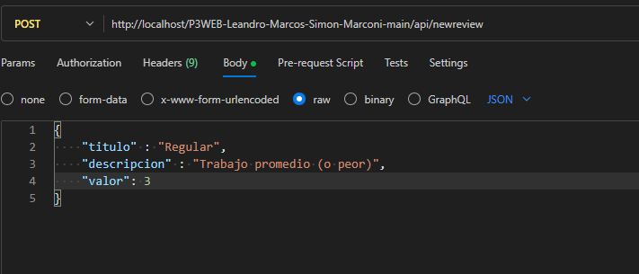

# P3WEB-Leandro-Marcos-Simon-Marconi

Descripcion:
La idea de esta nueva tabla era añadir reseñas o comentarios sobre la pagina, incluyendo titulo, descripcion y valor (estrellas).
Hicimos esta nueva tabla para no romper ni perturbar nuestra segunda entrega

🔗 Listado de endpoints y que accion es necesaria para ejecutarlos

    📜 Todas las reseñas de la tabla
    http://localhost/P3WEB-Leandro-Marcos-Simon-Marconi-main/api/allreviews
    Accion: GET

    🔍 Reseña en especifico
    http://localhost/P3WEB-Leandro-Marcos-Simon-Marconi-main/api/review/:id
    Accion: GET

    #️⃣ Ordenar reseñas por titulo
    http://localhost/P3WEB-Leandro-Marcos-Simon-Marconi-main/api/allreviews?orderBy=titulo
    Accion: GET

        ⬆️ Orden Ascendente
        http://localhost/P3WEB-Leandro-Marcos-Simon-Marconi-main/api/allreviews?orderBy=titulo&order=ASC
        Accion: GET

        ⬇️ Orden Descendente
        http://localhost/P3WEB-Leandro-Marcos-Simon-Marconi-main/api/allreviews?orderBy=titulo&order=DESC
        Accion: GET

    *️⃣ Ordenar reseñas por descripcion
    http://localhost/P3WEB-Leandro-Marcos-Simon-Marconi-main/api/allreviews?orderBy=descripcion
    Accion: GET
        
        ⬆️ Orden Ascendente
        http://localhost/P3WEB-Leandro-Marcos-Simon-Marconi-main/api/allreviews?orderBy=descripcion&order=ASC
        Accion: GET

        ⬇️ Orden Descendente
        http://localhost/P3WEB-Leandro-Marcos-Simon-Marconi-main/api/allreviews?orderBy=descripcion&order=DESC
        Accion: GET

    ⭐ Ordenar reseñas por valor
    http://localhost/P3WEB-Leandro-Marcos-Simon-Marconi-main/api/allreviews?orderBy=valor
    Accion: GET

        ⬆️ Orden Ascendente
        http://localhost/P3WEB-Leandro-Marcos-Simon-Marconi-main/api/allreviews?orderBy=valor&order=ASC
        Accion: GET

        ⬇️ Orden Descendente
        http://localhost/P3WEB-Leandro-Marcos-Simon-Marconi-main/api/allreviews?orderBy=valor&order=DESC

    🆕 Nueva reseña
    http://localhost/P3WEB-Leandro-Marcos-Simon-Marconi-main/api/newreview
    Accion: POST

    ♻️ Editar reseña
    http://localhost/P3WEB-Leandro-Marcos-Simon-Marconi-main/api/updatereview/:id
    Accion: PUT

    ❌ Eliminar reseña
    http://localhost/P3WEB-Leandro-Marcos-Simon-Marconi-main/api/delreview/:id
    Accion: DELETE

❗Aclaraciones
    ▪️ Para las funciones que se pretende ordenar por ascendente o descente, se aclara que por default ya se muestran de forma ascendente si no se establece un orden
    ▪️ Las url que tengan /:id debe tener reemplazado el "/:id" por el identificador o numero de la reseña que se busca (updatereview/4)
    ▪️ Ciertos id de reseñas no existen ya que se los eliminó a modo de prueba, por ejemplo el numero 4 o 7

❗NOTA
En las que se requiere agregar o editar una reseña, se debe poner en forma de JSON, a traves del Body, como se muestra a continuacion

✍️ Integrantes
    - Marcos, Leandro (46.094.776)
    - Marconi, Simon (46.344.129)